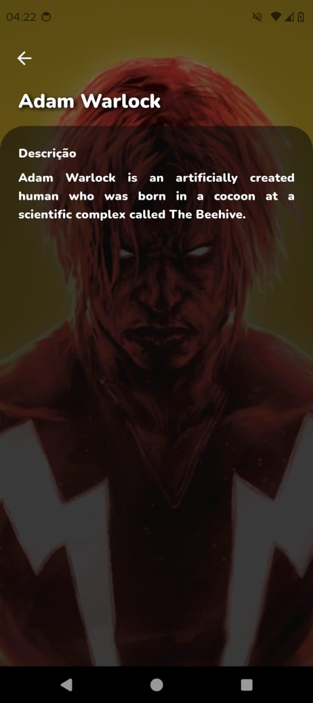
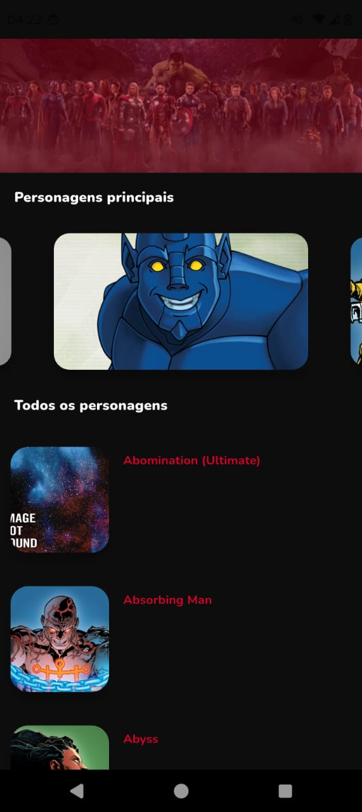
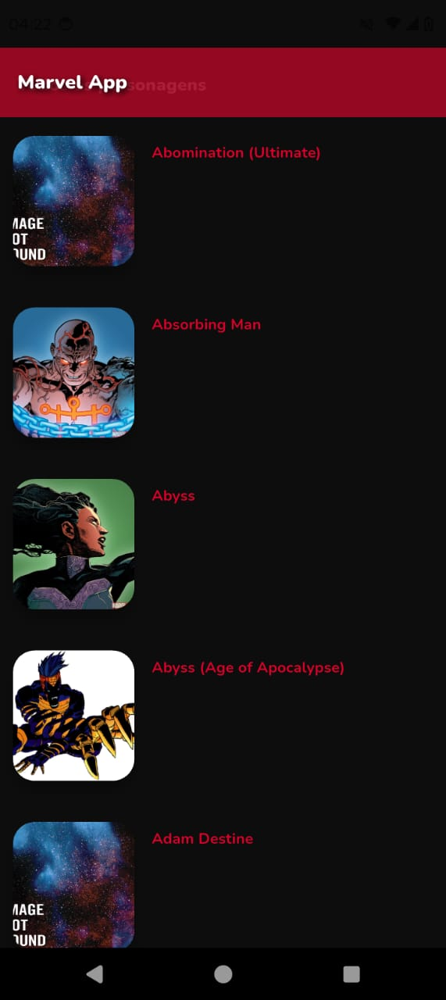
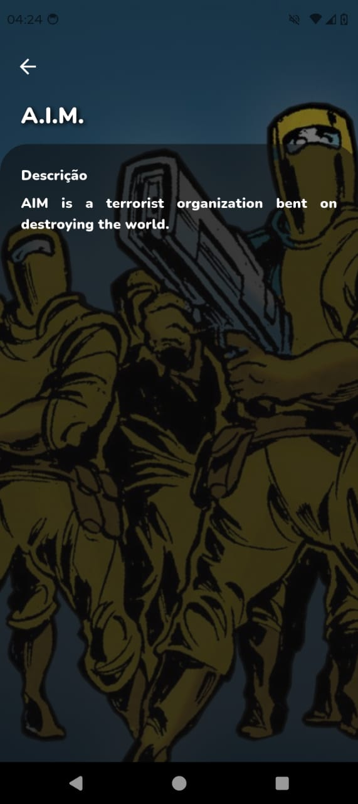

# 🦸‍♂️ Marvel App - Flutter + Clean Architecture

## 📲 Visualização

   <p align="center">
      
      
      
      
      
   </p>

## 📋 Visão Geral

Este projeto é uma aplicação Flutter que consome a **API pública da Marvel**, com foco em **robustez**, **manutenibilidade** e **escalabilidade**.

Ele adota a **Clean Architecture**, promovendo:

- ✅ **Modularização** clara por features e camadas
- ✅ **Reatividade** com `flutter_bloc`
- ✅ **Fonte única da verdade** com repositórios
- ✅ **Reutilização** de lógica via Use Cases
- ✅ **Alta testabilidade** em todas as camadas
- ✅ **Separação de responsabilidades** para um código limpo e sustentável

---
## 💡Observações Importantes:

- A API da Marvel pode apresentar instabilidade e limitação de requisições. O projeto foi desenhado para lidar com isso, mas falhas ocasionais são esperadas da fonte externa.

- Para garantir flexibilidade e resiliência, o projeto conta com dois data sources: um mock para desenvolvimento e testes rápidos, e um remoto para integração real com a API.

- Há uma preocupação contínua com a acessibilidade da interface, explorando o uso de scale para adaptação de tamanho e semanticsLabel para melhorar a navegação por leitores de tela.

## ✨ Funcionalidades

- 🔍 **Listagem de Personagens Marvel**  
  Exibe personagens obtidos da API com paginação.

- 🎠 **Carrossel de Destaque**  
  Mostra os 5 primeiros personagens em um carrossel interativo.

- 📄 **Detalhes do Personagem**  
  Permite visualizar informações detalhadas sobre cada herói (futuramente expansível).

- ❌ **Tratamento de Erros**  
  Feedback visual e lógico para falhas de rede, API ou dados inválidos.

- 🔄 **Carregamento Paginado**  
  Suporte a scroll infinito com `offset` e `limit`.

---

## 🎯 Tecnologias Principais

| Categoria | Tecnologia             | Versão   | Propósito                                        |
|----------|------------------------|----------|--------------------------------------------------|
| **Framework** | Flutter            | 3.7.x+   | UI Framework                                     |
| **Linguagem** | Dart               | Compatível | Lógica da aplicação                             |
| **Gerenciamento de Estado** | flutter_bloc | ^9.1.1   | BLoC/Cubit para UI reativa                      |
| **HTTP Client** | dio              | ^5.8.0+1 | Requisições HTTP robustas                       |
| **Cache de Imagens** | cached_network_image | ^3.4.1 | Cache e exibição de imagens                     |
| **Env Variables** | flutter_dotenv | ^5.2.1   | Variáveis de ambiente (.env)                    |
| **Mocking** | mocktail            | ^1.0.4   | Mocks para testes unitários                     |
| **Criptografia** | crypto          | ^3.0.6   | Hash para autenticação da Marvel API            |
| **Comparação** | equatable         | ^2.0.7   | Comparação de objetos baseada em valor          |
| **Testes Bloc** | bloc_test        | ^10.0.0  | Testes para bloc/cubit                          |
| **Injeção de Dependência** | get_it | ^8.0.3   | Service Locator                                  |
| **SVG** | flutter_svg             | ^2.2.0   | Renderização de gráficos vetoriais              |

## ⚙️ Como Executar o Projeto

Para rodar este projeto em sua máquina local, siga os passos abaixo:

1.  **Pré-requisitos:**
    * Certifique-se de ter o **Flutter SDK** instalado e configurado em sua máquina. Você pode verificar isso executando `flutter doctor` no terminal.

2.  **Clonar o Repositório:**

    ```bash
    git clone [https://github.com/seu-usuario/marvel_app.git](https://github.com/seu-usuario/marvel_app.git)
    cd marvel_app
    ```

3.  **Configurar Variáveis de Ambiente:**
    * A API da Marvel requer chaves de autenticação. Crie um arquivo `.env` na raiz do projeto (na mesma pasta onde está o `pubspec.yaml`).
    * Obtenha suas chaves (`PUBLIC_API_KEY` e `PRIVATE_API_KEY`) no [portal de desenvolvedores da Marvel](https://developer.marvel.com/).
    * Adicione as chaves ao arquivo `.env` da seguinte forma:

        ```
        PUBLIC_API_KEY=sua_chave_publica_aqui
        PRIVATE_API_KEY=sua_chave_privada_aqui
        ```

4.  **Instalar Dependências:**
    * No diretório raiz do projeto, execute:

        ```bash
        flutter pub get
        ```


5.  **Rodar a Aplicação:**
    * Conecte um dispositivo Android ou iOS (ou inicie um emulador/simulador).
    * No terminal, execute:

        ```bash
        flutter run
        ```

    A aplicação será compilada e iniciada no dispositivo ou emulador conectado.

---

