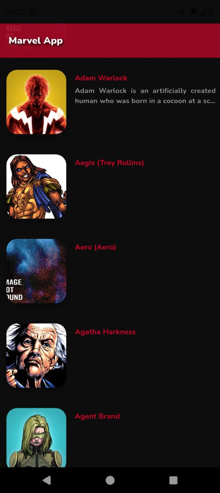

# 🦸‍♂️ Marvel App - Flutter + Clean Architecture

## 📲 Visualização

   

      
      
      
   

   

      
      
      
   

## 📋 Visão Geral

Este projeto é uma aplicação Flutter que consome a **API pública da Marvel**, com foco em **robustez**, **manutenibilidade** e **escalabilidade**.

Ele adota a **App Architecture (Google/Flutter)** com princípios da **Clean Architecture**, promovendo:

- ✅ **Modularização** clara por features e camadas
- ✅ **Reatividade** com `flutter_bloc`
- ✅ **Fonte única da verdade** com repositórios
- ✅ **Reutilização** de lógica via Use Cases
- ✅ **Alta testabilidade** em todas as camadas
- ✅ **Separação de responsabilidades** para um código limpo e sustentável

---

## ✨ Funcionalidades

- 🔍 **Listagem de Personagens Marvel**  
  Exibe personagens obtidos da API com paginação.

- 🎠 **Carrossel de Destaque**  
  Mostra os 5 primeiros personagens em um carrossel interativo.

- 📄 **Detalhes do Personagem**  
  Permite visualizar informações detalhadas sobre cada herói (futuramente expansível).

- ❌ **Tratamento de Erros**  
  Feedback visual e lógico para falhas de rede, API ou dados inválidos.

- 🔄 **Carregamento Paginado**  
  Suporte a scroll infinito com `offset` e `limit`.

---

## 🎯 Tecnologias Principais

| Categoria | Tecnologia             | Versão   | Propósito                                        |
|----------|------------------------|----------|--------------------------------------------------|
| **Framework** | Flutter            | 3.7.x+   | UI Framework                                     |
| **Linguagem** | Dart               | Compatível | Lógica da aplicação                             |
| **Gerenciamento de Estado** | flutter_bloc | ^9.1.1   | BLoC/Cubit para UI reativa                      |
| **HTTP Client** | dio              | ^5.8.0+1 | Requisições HTTP robustas                       |
| **Cache de Imagens** | cached_network_image | ^3.4.1 | Cache e exibição de imagens                     |
| **Env Variables** | flutter_dotenv | ^5.2.1   | Variáveis de ambiente (.env)                    |
| **Mocking** | mocktail            | ^1.0.4   | Mocks para testes unitários                     |
| **Criptografia** | crypto          | ^3.0.6   | Hash para autenticação da Marvel API            |
| **Comparação** | equatable         | ^2.0.7   | Comparação de objetos baseada em valor          |
| **Testes Bloc** | bloc_test        | ^10.0.0  | Testes para bloc/cubit                          |
| **Injeção de Dependência** | get_it | ^8.0.3   | Service Locator                                  |
| **SVG** | flutter_svg             | ^2.2.0   | Renderização de gráficos vetoriais              |

